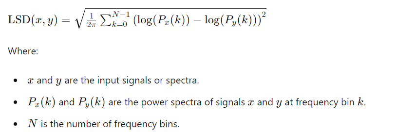
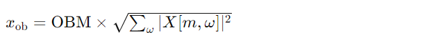

# CFTNet-for-Speech-Enhancement
This repository is involving the implementation of CFTNet architecture. The model is Trainned and tested with the audio data.

### Why should we use meanvar_norm istead of default norm, mean ?
It performs both mean normalization and variance normalization (L2 Normalization). This dual normalization helps to standardize the data, making it more suitable for various machine learning and signal processing tasks. 

meanvar_norm = x / sqrt(sum((x-mean)^2))

# Important Terms 
### What is sound pressure level (SPL)?
Sound pressure level (SPL) is the pressure level of a sound, measured in decibels (dB).
 It is equal to 20Log10(Root Mean Square (RMS) of sound pressure)/(reference of sound pressure)  (the reference sound pressure in air is 2 x 10-5 N/m2, or 0,00002 Pa). 

### What is STFT(Short Time Fourier Transformation) and Normalization ?
STFT: Converts the time-domain signal into a time-frequency representation, producing a 2D array (spectrogram) where one axis represents time and the other represents frequency.

Normalization: Adjusts the amplitude of the spectrogram values, often to a common scale.

### Explain STFT with equation? 
The STFT is used to transform a signal from the time domain to the frequency domain. The equation for STFT used :

### What is Octave Band Matrix (OBM) ?
The Octave Band Matrix (OBM) is used to aggregate spectral components into frequency bands to better represent human auditory perception. The equation used in the code is:

### What is Log Power Spectrum (LPS) ?
The Log Power Spectrum is a representation of the signal's power across different frequencies, expressed in decibels (dB). It is commonly used in audio signal processing for tasks like speech recognition, noise reduction, and audio analysis.

# Evalution Matrices 
### What is log spectral distance (LSD) ?
LSD measures the distance between two power spectra on a logarithmic scale. It's particularly useful when comparing signals in the frequency domain, where differences in spectral shape are important.

### What is Scale-Invariant Signal-to-Noise Ratio (SiSNR) ?
It is a metric used to evaluate the quality of source separation. It measures the ratio of the power of the target signal to the power of the interference (noise) signal, considering the scale differences between the sources.

### What is Short Time Obejective Intelligiblity(STOI)?
It measures the similarity between the clean and processed speech signals over short time frames, providing a score between 0 and 1, where a higher score indicates better intelligibility.

### What is Negative STOI Loss (NegSTOILoss)?
The negative STOI loss is computed based on the STOI metric, which measures the intelligibility of speech signals. The computation involves various steps including normalization, masking, and averaging. The overall equation for negative STOI loss (negSTOI) in the code is:

1. Resampling : adjusts the sample rate of the input signals.

2. STFT : is applied to convert time-domain signals into the frequency domain.

3. Third-Octave Band Processing : applies a filter bank to the magnitude spectra.

4. Frame Segmentation : divides the spectra into overlapping frames.

5. Voice Activity Detection (VAD) : masks silent frames.\

6. Normalization and Clipping : ensure the spectral envelopes are normalized and clipped appropriately.

7. Correlation Computation : calculates the correlation between the clean and estimated signals.

8. Compute STOI and Negate: uses the negative STOI score as the loss for optimization.

